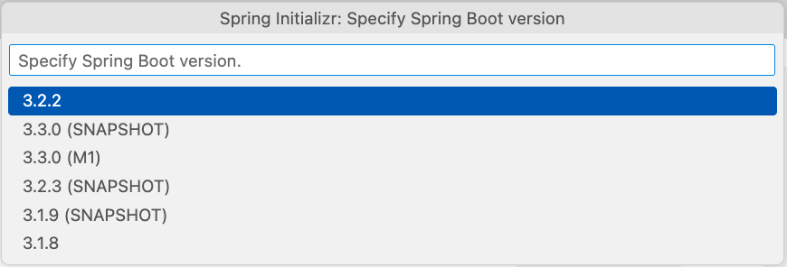
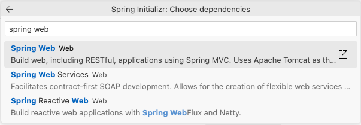

# Build the Account Microservice

## Introduction

This lab walks you through the steps to build a Spring Boot microservice from scratch, and to deploy it into the Oracle Backend for Spring Boot.  In this lab, we will build the "Account" microservice.  In the next lab, the remaining Cloud Bank microservices will be provided for you.

Estimated Time: 20 minutes

### About Spring Boot
Enter background information here about the technology/feature or product used in this lab - no need to repeat what you covered in the introduction. Keep this section fairly concise. If you find yourself needing more than two sections/paragraphs, please utilize the "Learn More" section.

### Objectives

In this lab, you will:
* Create a new Spring Boot project in your IDE
* Plan your accounts database and create Liquibase files to automate creation of the database objects
* Use Spring Data JPA to allow your microservice to use the data in the Orace database
* Create REST services to allow clients to perform create, read, update, and delete operations on accounts
* Learn how to externalize configuration for your microservice
* Deploy your microservice into the backend
* TODO ?? Learn how to use service discovery

### Prerequisites (Optional)

This lab assumes you have:
* An Oracle Cloud account
* All previous labs successfully completed

## Task 1: Create a Spring Boot project

Create a project to hold your Account service.  In this lab, you will use the Spring Initialzr directly from Visual Studio Code, however it is also possible to use [Spring Initialzr](http://start.spring.io) online and download a zip file with the generated project.

1. Create the project

   In Visual Studio Code, press Ctrl+Shift+P (or equivalent) to access the command window.  Start typing "Spring Init" and you will see a number of options to create a Spring project, as shown in the image below.  Select the option to **Create a Maven Project**.
   
   
   
   You will be presented with a list of available Spring Boot versions.  Choose **2.7.9** (or the latest 2.7.x version available).  Do not choose a 3.x version for this lab - there are some breaking changes in 3.x which mean that some of the instructions in this lab will not work with 3.x.

   
   
   Next, you will be asked to choose the implementation language.  Choose **Java** from the available options.

   
   
   You will be asked for the Maven Group ID for this new project, you can use **com.example** (the default value).

   
   
   You will be asked for the Maven Artifact ID for this new project, enter **accounts**.

   
   
   You will be asked what type of packaging you want for this new project, select **JAR** from the list of options.

   
   
   Next, you will be asked what version of Java to use.  Select **17** from the list of options.  Technically you could use an earlier version of Java with Spring Boot 2.7.x, however the lab instructions assume you are using Java 17, so it is better to choose that to avoid issues during this lab.  Note that Spring Boot 3.0 requires Java 17 as the minimum level. 

   
   
   Now you will have the opportunity to add the Spring Boot dependencies your project needs.  For now just add **Spring Web**, which will let us write some REST services.  We will add more later as we need them.  After you add Spring Web, click on the option to continue with the selected dependencies.

   
   
   You will be asked where to save the project.  Note that this needs to be an existing location.  You may wish to create a directory in another terminal if you do not have a suitable location.  Enter the directory to save the project in and press Enter. 

   
   
   Now the Spring Initializr will create a new project based on your selections and place it in the directory you specified.  This will only take a few moments to complete.  You will a message in the bottom right corner of Visual Studio Code telling you it is complete.  Click on the **Open** button in that message to open your new project in Visual Studio Code.

   
   
   Explore the new project.  You should find the main Spring Boot application class and your Spring Boot `application.properties` file as shown in the image below.

   
   
   If desired, you can delete some of the generated files that you will not need.  You can remove `.mvn`, `mvnw`, `mvnw.cmd` and `HELP.md` if you wish.  Leaving them there will not cause any issues.

1. Build and run the service

    Open a terminal in Visual Studio Code by selecting **New Terminal** from the **Terminal** menu (or if you prefer, just use a separate terminal application).
    Build and run the newly created service with this command:

    ```
    $ <copy>mvn spring-boot:run</copy>
    ```

    The service will take a few seconds to start, and then you will see some messages similar to these:

    ```
    2023-02-25 12:27:21.277  INFO 20507 --- [           main] o.s.b.w.embedded.tomcat.TomcatWebServer  : Tomcat started on port(s): 8080 (http) with context path ''
    2023-02-25 12:27:21.282  INFO 20507 --- [           main] c.example.accounts.AccountsApplication   : Started AccountsApplication in 0.753 seconds (JVM running for 0.893)
    ```

    Of course, the service does not do anything yet, but you can still make a request and confirm you get a response from it:

    ```
    $ <copy>curl http://localhost:8080</copy>
    {"timestamp":"2023-02-25T17:28:23.264+00:00","status":404,"error":"Not Found","path":"/"}
    ```

## Task 2: Implement your first service

1. Implement the first simple endpoint    

    Create a new directory in the directory `src/main/java/com/example/accounts` called `controller`.  In that new directory, create a new Java file called `AccountController.java`.  When prompted for the type, choose **class**.

    Your new file should look like this:

    ```java
    package com.example.accounts.controller;
    
    public class AccountController {
        
    }
    ```

    Add the `RestController` annotation to this class to tell Spring Boot that we want this class to expose REST services.  You can just start typing `@RestController` before the `public class` statement and Visual Studio Code will offer code completion for you.  When you select from the pop-up, Visual Studio Code will also add the import statement for you.  The list of suggestions is based on the dependencies you added to your project.

    Add the `RequestMapping` annotation to this class as well, and set the URL path to `/api/v1`.  Your class should now look like this: 

    ```java
    package com.example.accounts.controller;
    
    import org.springframework.web.bind.annotation.RequestMapping;
    import org.springframework.web.bind.annotation.RestController;
    
    @RestController
    @RequestMapping("/api/v1")
    public class AccountController {
        
    }
    ```

    Add a method to this class called `ping` which returns a `String` with a helpful message.  Add the `GetMapping` annotation to this method and set the URL path to `/hello`.  Your class should now look like this: 

    ```java
    package com.example.accounts.controller;
    
    import org.springframework.web.bind.annotation.GetMapping;
    import org.springframework.web.bind.annotation.RequestMapping;
    import org.springframework.web.bind.annotation.RestController;
    
    @RestController
    @RequestMapping("/api/v1")
    public class AccountController {
        
      @GetMapping("/hello")
      public String ping() {
        return "Hello from Spring Boot";
      }
    
    }
    ```

    You have just implemented your first REST service in Spring Boot!  This service will be available on `http://localhost:8080/api/v1/hello`.  And the `GetMapping` annotation tells Spring Boot that this servive will respond to the HTTP GET method. 

    You can test your service now by building and running again.  If you still have the application running from before, hit Ctrl+C (or equivalent) to stop it, and then build and run with this command:

    ```
    $ <copy>mvn spring-boot:run</copy>
    ```

    Then try to call your service with this command:

    ```
    $ <copy>curl -i http://localhost:8080/api/v1/hello</copy>
    HTTP/1.1 200 
    Content-Type: text/plain;charset=UTF-8
    Content-Length: 22
    Date: Sat, 25 Feb 2023 17:59:52 GMT
    
    Hello from Spring Boot
    ```

    Great, it works!  Notice it returned HTTP Status Code 200 (OK) and some HTTP Headers along with the body which contained your message.  Later we will see how to return JSON and to set the status code appropriately.

## Task 3: Prepare objects in the Oracle Database

1. Create the database objects for the Account service

    The Accounts service is going to have two main objects - an "account" and a "transaction".  These will be stored in the Oracle Database.  The accounts will be stored in a regular relational table, and the transactions will be stored in a Blockchain table.

    > **Note**: Blockchain tables are append-only tables in which only insert operations are allowed. Deleting rows is either prohibited or restricted based on time. Rows in a blockchain table are made tamper-resistant by special sequencing and chaining algorithms. Users can verify that rows have not been tampered. A hash value that is part of the row metadata is used to chain and validate rows.

    Here are the SQL statements to create the necessary objects in the database.  You can run these against your local Oracle Database container to use during development.
    If you installed SQLcl as recommended, you can connect to your database using this command:

    ```
    $ <copy>sql pdbadmin/Welcome123@//172.17.0.2:1521/pdb1</copy>
    ```
    
    When you are connected, run the SQL statements below to create the databse objects:
    
    ```sql
    <copy>
    -- create a database user for the account service
    create user account_svc identified by "Welcome1234##";
    
    -- add roles and quota
    grant connect to account_svc;
    grant resource to account_svc;
    alter user account_svc default role connect, resource;
    alter user account_svc quota unlimited on data;
    
    -- create accounts table
    create table account_svc.accounts (
        account_id            number generated always as identity (start with 1 cache 20),
        account_name          varchar2(40) not null,
        account_type          varchar2(2) check (account_type in ('CH', 'SA', 'CC', 'LO')),
        customer_id           varchar2 (20),
        account_opened_date   date default sysdate not null,
        account_other_details varchar2(4000),
        account_balance       number
    ) logging;
    
    alter table account_svc.accounts 
    add constraint accounts_pk 
    primary key (account_id) 
    using index logging;
    comment on table account_svc.accounts 
    is 'CloudBank accounts table';
    
    -- create transactions table
    create blockchain table account_svc.transactions (
        transaction_id     number generated always as identity (start with 1 cache 20),
        transaction_date   date default sysdate not null,
        transaction_amount number,
        transaction_type   varchar(2) check (transaction_type in ('DE', 'CR')),
        account_id         number not null
    ) no drop until 0 days idle no delete locked hashing using "SHA2_512" version "v1" logging;
    
    alter table account_svc.transactions
    add constraint transactions_pk
    primary key (transaction_id) 
    using index logging;
    comment on table account_svc.transactions 
    is 'CloudBank transactions table';
    </copy>
    ```
    
    TODO TODO

##  Task 4: Use Spring Data JPA to access the database

1. Add Spring Data JPA to the Account service and configure it to access the database

    Spring Data JPA allows our Spring Boot application to easily use the database.  It uses simple Java POJOs to represent the data model and provides a lot of out-of-the-box features which means there is a lot less boilerplate code to be written. 

    To add Spring Data JPA and the Oracle Database drivers to your project, open the Maven POM (`pom.xml`) and add this extra dependency for the Oracle Spring Boot
    Starter for Oracle Database UCP:

    ```xml
    <copy>
    <dependency>
        <groupId>com.oracle.database.spring</groupId>
        <artifactId>oracle-spring-boot-starter-ucp</artifactId>
        <type>pom</type>
        <version>2.7.7</version>
    </dependency>
    </copy>
    ```

    To configure Spring Data JPA access to the database, you will add some configuration information to the Spring Boot application properties (or YAML) file.
    You will find a file called `application.properties` in the `src/main/resources` directory in your project.  You can use either properties format or YAML
    format for this file.  In this lab, you will use YAML.  Rename the file to `applciation.yaml` and then add this content to the file:

    ```yaml
    spring:
      application:
        name: accounts
      jpa:
        hibernate:
          ddl-auto: validate
        properties:
          hibernate:
            dialect: org.hibernate.dialect.OracleDialect
            format_sql: true
        show-sql: true
      datasource:
        url: jdbc:oracle:thin:@//172.17.0.2:1521/pdb1
        username: account_svc
        password: Welcoem1234##
        driver-class-name: oracle.jdbc.OracleDriver
        type: oracle.ucp.jdbc.PoolDataSource
        oracleucp:
          connection-factory-class-name: oracle.jdbc.pool.OracleDataSource
          connection-pool-name: TransactionConnectionPool
          initial-pool-size: 15
          min-pool-size: 10
          max-pool-size: 30
    ```

1. Create the data model in the Spring Boot application

    


## Task 5: Write services to create and query accounts in the Oracle Database 

1. do a thing

    TODO

1. do another thing

    TODO


## Learn More

*(optional - include links to docs, white papers, blogs, etc)*

* [URL text 1](http://docs.oracle.com)
* [URL text 2](http://docs.oracle.com)

## Acknowledgements
* **Author** - <Name, Title, Group>
* **Contributors** -  <Name, Group> -- optional
* **Last Updated By/Date** - <Name, Month Year>
