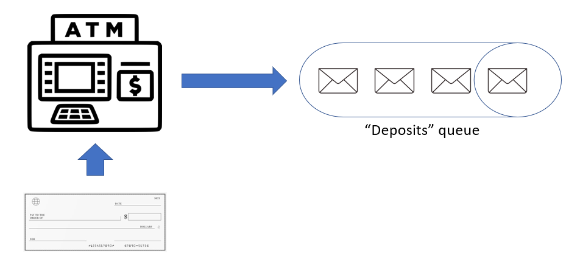

# Build the Check Processing Microservices

## Introduction

This lab walks you through the steps to build Spring Boot microservices that use Java Message Service (JMS) to send and receive aysnchronous messages.  This service will also use service discovery to lookup and use the previously built Account service.  In this lab, we will extend the Account microservice built in the previous lab, build a new "Check Processing" microservice and another "Test Runner" microservice to help with testing.

Estimated Time: 20 minutes

### Objectives

In this lab, you will:

* Create new Spring Boot projects in your IDE
* Plan your queues and message formats
* Use Spring JMS to allow your microservice to use JMS queues in the Oracle database
* Use OpenFeign to allow the Check Processing service to discover and use the Account service
* Create a "Test Runner" service to simulate the sending of messages 
* Deploy your microservices into the backend

### Prerequisites (Optional)

This lab assumes you have:

* An Oracle Cloud account
* All previous labs successfully completed

## Task 1: Learn about the scenario for this lab

In the previous lab, you created an Account service that includes endpoints to create and query accounts, lookup accounts for a given customer, and so on.  In this lab you will extend that service to add some new endpoints to allow recording bank transactions, in this case check deposits, in the account journal.

In this lab, we will assume that customers can deposit a check at an Automated Teller Machine (ATM) by typing in the check amount and placing the actual check into a deposit envelope and then inserting that envelope into the ATM.  When this occurs, the ATM will send a "deposit" message with details of the check deposit.  You will record this as a "pending" deposit in the account journal.

Later, imagine that the deposit envelop arrives at a back office check processing facility where a person checks the details are correct, and then "clears" the check.  When this occurs, a "clearance" message will be sent.  Upon receiving this message, you will change the "pending" transaction to a finalized "deposit" in the account journal. 

You will implement this using three microservices:

* The Account service you created in the previous lab will have the endpoints to manipulate journal entries
* A new "Check Processing" service will listen for messages and process them by calling calling the appropriate endpoints on the Account service
* A "Test Runner" service will simulate the ATM and the back office and allow you to send the "deposit" and "clearance" messages to test your other services

TODO DIAGRAM HERE

## Task 2: Create a Spring Boot project

Create a project to hold your Account service.  In this lab, you will use the Spring Initialzr directly from Visual Studio Code, however it is also possible to use [Spring Initialzr](http://start.spring.io) online and download a zip file with the generated project.

1. Create the project

   In Visual Studio Code, press Ctrl+Shift+P (or equivalent) to access the command window.  Start typing "Spring Init" and you will see a number of options to create a Spring project, as shown in the image below.  Select the option to **Create a Maven Project**.

  
## Learn More

* [Oracle Backend for Spring Boot](https://oracle.github.io/microservices-datadriven/spring/)

## Acknowledgements

* **Author** - Mark Nelson, Developer Evangelist, Oracle Database
* **Contributors** - 
* **Last Updated By/Date** - Mark Nelson, June 2023
