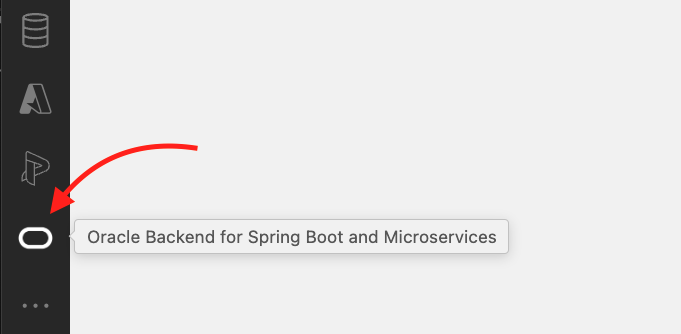
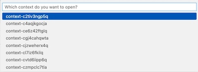
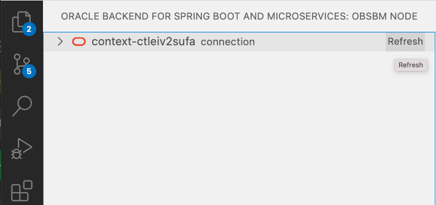
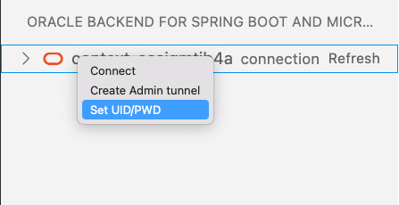
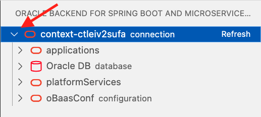
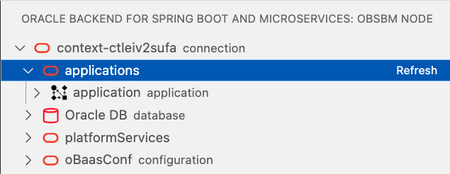
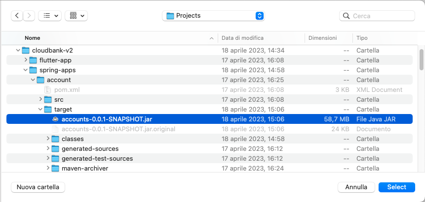
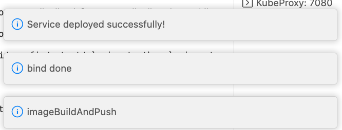
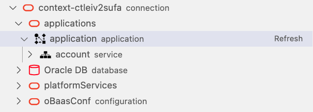
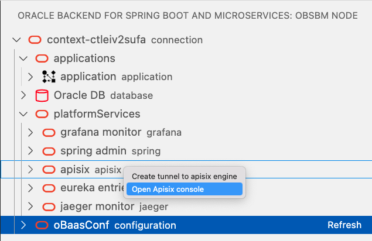

# Deploy the full CloudBank Application using the VS Code Extension

## Introduction

Now that you know how to build a Spring Boot microservice and deploy it to the Oracle Backend for Spring Boot and Microservices, this lab will guide you through deploying the rest of the Cloud Bank services that we have already built for you and exploring the runtime and management capabilities of the platform.

If you already have completed the lab *Deploy the full CloudBank Application using the CLI* You can skip Task *1* and Task *2*.

Estimated Lab Time: 30 minutes

### Objectives

In this lab, you will:

* Deploy the full CloudBank sample application into your Oracle Backend for Spring Boot for Microservices instance using the VSCode Extension.

### Prerequisites

This lab assumes you have:

* An Oracle Cloud account
* Have all the necessary tools installed (kubectl, git, maven, oractl, sqlcl, curl, jq). All of them should be installed during Lab two (Setup your Development Environment)
* Installed the VS Code Extension
* Git version control tool installed on your computer (optional)

## Task 1: Get a copy of the CloudBank sample application

Download a copy of the CloudBank sample application.

1. Clone the source repository

    Create a local clone of the CloudBank source repository using this command.

    ```shell
    <copy>git clone https://github.com/oracle/microservices-datadriven.git</copy>
    ```

    > **Note**: If you do not have **git** installed on your machine, you can download a zip file of the source code from [GitHub](https://github.com/oracle/microservices-datadriven) and unzip it on your machine instead.

    The source code for the CloudBank application will be in the `microservices-datadriven` directory you just created, in the `cloudbank-v32` subdirectory.

    ```shell
    <copy>cd microservices-datadriven/cloudbank-v32</copy>
    ```

## Task 2: Build the CloudBank application

1. Create application JAR files

    In the directory where you cloned (or unzipped) the application and build the application JARs using the following command:

    ```shell
    <copy>mvn clean package</copy>
    ```

    The output should be similar to this:

    ```text
    [INFO] ------------------------------------------------------------------------
    [INFO] Reactor Summary for cloudbank 0.0.1-SNAPSHOT:
    [INFO]
    [INFO] cloudbank .......................................... SUCCESS [  0.972 s]
    [INFO] account ............................................ SUCCESS [  2.877 s]
    [INFO] customer ........................................... SUCCESS [  1.064 s]
    [INFO] creditscore ........................................ SUCCESS [  0.922 s]
    [INFO] transfer ........................................... SUCCESS [  0.465 s]
    [INFO] testrunner ......................................... SUCCESS [  0.931 s]
    [INFO] checks ............................................. SUCCESS [  0.948 s]
    [INFO] ------------------------------------------------------------------------
    [INFO] BUILD SUCCESS
    [INFO] ------------------------------------------------------------------------
    [INFO] Total time:  8.480 s
    [INFO] Finished at: 2023-11-06T12:35:17-06:00
    [INFO] ------------------------------------------------------------------------
    ```

## Task 3: Using Oracle Backend for Spring Boot VS Code plugin

1. If you have done the optional **Task 11** of **Lab. 2**, you could proceed doing the activities from **Task 3** to **Task 5** using **Oracle Backend for Spring Boot VS Code plugin**.
    If you don't see the plugin in the left bar, with the Oracle logo, as shown here:

    

    click on **Additional Views** menu to select the **Oracle Backend fo Spring Boot and Microservices**.

    The  Oracle Backend fo Spring Boot and Microservices VS Code plugin will ask to specify the Kubernetes config file full path as shown here:

    

    By default it's shown the path in the user's Home directory **.kube/config** in which normally **kubectl** stores all the information regarding the K8S clusters configured. You could set the full path of another Kubernetes config file.
    If the file is correctly loaded, the plugin will show the list of contexts available in which select one:

    

    In positive case, you should see a tree view with one node and the context chosen:

    

    If the file path it hasn't been correctly set, it will shown an error message:

    

    To restart the plugin and proceed again in Kubernetes config file setting, in command palette execute a **Reload Window** command:

    

2. How to access to cluster

    Until you create a dedicated ssh tunnel to the Kubernetes cluster, and you don't connect to Oracle Backend for Spring Boot admin services, you will not be able to browse resources included into the Oracle Backend for Spring Boot deployment. To do this, follow these steps:

    * Obtain the `obaas-admin` password by executing the following command in a terminal window to get the `obaas-admin` password:

        ```shell
        $ <copy>kubectl get secret -n azn-server  oractl-passwords -o jsonpath='{.data.admin}' | base64 -d</copy>
        ```

    * Right click on the cluster name and select **Set UID/PWD**:

        

    * Enter the username *obaas-admin* for the Oracle Backend for Spring Boot.

        

    * Followed by the password you obtained in an earlier step:

        

    * Two message boxes will confirm credentials have been set correctly:

        

        **WARNING**: if you don't execute this steps and try to expand the kubernetes context, you will receive a message:

        

    * Select again the cluster and click the right mouse button and choose **Create Admin tunnel** menu item.

        

        VS Code will open a new terminal that will try to open a tunnel to the Kubernetes cluster on a local port, starting from 8081:

        

    * Before proceed to connection, please wait until the tunnel is established and the terminal shows a message like this:

        

        **NOTE**: if the K8s cluster it's not related to an Oracle Backend for Spring Boot deployment, the tunnel creation will fail. In this case in command palette execute a window reload to chose another cluster. If you have any problem in connection, you could start another tunnel: the plugin will try on another local port to connect to the cluster.

    * Again select the cluster and by clicking the right mouse button choose **Connect** menu item. This will create a session with credentials set at the first step.

        

3. Explore resources

    As soon as completed the steps to create tunnel and you get connected to the backend, it's possible to expand or refresh the tree related to the deployment.

   

    You'll see four top classes of resources that can be exploded in underlying items:
    * **applications**: the list of applications deployed and the services holding
    * **Oracle DB**: in this release we have one Database in which are stored configuration and schema related to services deployed
    * **platformServices**: the list of Oracle Backend for Spring Boot deployed services, like Grafana, Spring, Apisix, Eureka and Jaeger.
    * **oBaasConf**: the list of keys defined by application, stored in the ADB provisioned and available to share configuration information among services in each application.

    Let's go to show the operations you can do on each item of browse tree.

    Open the list clicking on the arrow at the left of **applications**, and then expand the application about you want to know which services includes:

    

    it should be empty. If not, proceed to delete the full **application** and re-create it through the plug-in:

    * First, select the default **application** and with right-click on mouse, select **Delete application**:

        

    * Wait a moment and refresh the content of **applications** leaf. When empty, select **applications** and with right-click on mouse, select **Add application**:

        

    * Fill in the command palette the (application name) with **application**:

        

4. The four Spring Boot microservices deployment

    First it must be bind the service if the case. For **account** service you have to:

    * Select applications leaf and with right click select **Bind a service** item menu:

        

    * and the input following values:
        * **Service Name**: account
        * **DB User (optional)**: 
        * **DB User Password**: Welcome1234## 
        * **Spring Binding Prefix (optional)**: spring.datasource
        * **Update**: False

    * you'll get the message:

    

    Let's start with the first service deployment:

    * Select **application** under **applications** and Right-click on mouse to select **Add service -> upload .jar**:

        

    * Look for the **accounts-0.0.1-SNAPSHOT.jar** file built previously:

        

    * In the command palette will be asked all the parameters needed to upload the services, starting from binding, that for **account** service requires a **True** answer:

        

    and then:
    * **Service Name** : `account`
    * **Image Version**:  `0.0.1`
    * **Java Image**: leave default `ghcr.io/graalvm/jdk:ol7-java17-22.2.0`
    * **is it a redeploy**: **False**
    * **Add Health probe?**: **False**
    * **Service Port**: leave default `8080`
    * **Service Profile**: leave default `obaas`
    * **Initial Replicas** : 1
    * **Inform the database name for Liquibase**:  

    * You will see messages that confirm the deployment is started:

        

    * Finally you'll receive the message "**Service deployed successfully**":

        

    * Refreshing the **application** leaf, you should see now:

        

    Now we have prepare binding for **customer** too before deployment in this way.

    * Select applications leaf and with right click select **Bind a service** item menu:

        

    * and the input following values:
        * **Service Name**: customer
        * **DB User (optional)**:
        * **DB User Password**: Welcome1234##
        * **Spring Binding Prefix (optional)**: spring.datasource
        * **Update**: False

    * you'll get the message:

    

    Let's start with the **customer** service deployment:

    * Select **application** under **applications** and Right-click on mouse to select **Add service -> upload .jar**.

    * Look for the **customer-0.0.1-SNAPSHOT.jar** file built previously:

    * In the command palette will be asked all the parameters needed to upload the services, starting from binding, that for **customer** service requires a **True** answer:

        

    and then:
    * **Service Name** : `customer`
    * **Image Version**:  `0.0.1`
    * **Java Image**: leave default `ghcr.io/graalvm/jdk:ol7-java17-22.2.0`
    * **is it a redeploy**: **False**
    * **Add Health probe?**: **False**
    * **Service Port**: leave default `8080`
    * **Service Profile**: leave default `obaas`
    * **Initial Replicas** : 1
    * **Inform the database name for Liquibase**: 

    As before, you will see messages that will confirm the deployment is started and finally "**Service deployed successfully**".

    Finally, we'll deploy the services that don't require to be bound to a schema, the **creditscore** and **transfer**:

    * Select **application** under **applications** and Right-click on mouse to select **Add service -> upload .jar**.

    * Look for the **creditscore-0.0.1-SNAPSHOT.jar** file built previously:

    * In the command palette will be asked all the parameters needed to upload the services, starting from binding, that for **creditscore** service requires a **False** answer:

        

    and then:
    * **Service Name** : `creditscore`
    * **Image Version**:  `0.0.1`
    * **Java Image**: leave default `ghcr.io/graalvm/jdk:ol7-java17-22.2.0`
    * **is it a redeploy**: **False**
    * **Add Health probe?**: **False**
    * **Service Port**: leave default `8080`
    * **Service Profile**: leave default `obaas`
    * **Initial Replicas** : 1
    * **Inform the database name for Liquibase**: 

    As before, you will see messages that will confirm the deployment is started and finally "**Service deployed successfully**".

    Proceed to the final CloudBank service deployment, for **transfer**:

    * Select **application** under **applications** and Right-click on mouse to select **Add service -> upload .jar**.

    * Look for the **transfer-0.0.1-SNAPSHOT.jar** file built previously:

    * In the command palette will be asked all the parameters needed to upload the services, starting from binding, that for **transfer** service requires a **False** answer:

        

    and then:
    * **Service Name** : `transfer`
    * **Image Version**:  `0.0.1`
    * **Java Image**: leave default `ghcr.io/graalvm/jdk:ol7-java17-22.2.0`
    * **is it a redeploy**: **False**
    * **Add Health probe?**: **False**
    * **Service Port**: leave default `8080`
    * **Service Profile**: leave default `obaas`
    * **Initial Replicas** : 1
    * **Inform the database name for Liquibase**: 

    As before, you will see messages that will confirm the deployment is started and finally "**Service deployed successfully**".

    Now we have the three services up & running as you should see from VS Code plug-in:

    

5. Verify that the services are running properly by executing this command:

    ```shell
    $ <copy>kubectl get all -n application</copy>
    ```

    The output should be similar to this, all applications must have `STATUS` as `Running`

    ```text
    NAME                              READY   STATUS    RESTARTS   AGE
    pod/account-5cd5dbdd7f-m7zlf      1/1     Running   0          14m
    pod/creditscore-fcf8d985b-f8q4n   1/1     Running   0          5m37s
    pod/customer-6b6f58f59-f6vl9      1/1     Running   0          7m18s
    pod/transfer-f9c96cb56-6796s      1/1     Running   0          113s

    NAME                  TYPE        CLUSTER-IP       EXTERNAL-IP   PORT(S)    AGE
    service/account       ClusterIP   10.191.135.77    <none>        8080/TCP   19m
    service/creditscore   ClusterIP   10.191.68.122    <none>        8080/TCP   5m38s
    service/customer      ClusterIP   10.191.172.239   <none>        8080/TCP   7m19s
    service/transfer      ClusterIP   10.191.172.125   <none>        8080/TCP   114s

    NAME                          READY   UP-TO-DATE   AVAILABLE   AGE
    deployment.apps/account       1/1     1            1           19m
    deployment.apps/creditscore   1/1     1            1           5m39s
    deployment.apps/customer      1/1     1            1           7m20s
    deployment.apps/transfer      1/1     1            1           115s

    NAME                                    DESIRED   CURRENT   READY   AGE
    replicaset.apps/account-5cd5dbdd7f      1         1         1       19m
    replicaset.apps/creditscore-fcf8d985b   1         1         1       5m39s
    replicaset.apps/customer-6b6f58f59      1         1         1       7m20s
    replicaset.apps/transfer-f9c96cb56      1         1         1       115s
    ```

6. Expose the services using APISIX Gateway

    Execute the same actions as described in **Lab. 5, Task 5** except for the **step 4.**, that it could be executed in the following alternative way, accessing comfortably to the APISIX admin console straight from VS Code.

    * Select under **platformServices** the leaf **apisix** and, with a right-click on mouse, select **Open Apisix console**:

        

    * It will open a terminal window in which it will be started a tunneling to that service, that will end opening a message box with a button you can click to open the APISIX admin console in a new browser:

        

## Learn More

* [Oracle Backend for Spring Boot](https://bit.ly/oraclespringboot)
* [Oracle Backend for Parse Platform](https://oracle.github.io/microservices-datadriven/mbaas/)
* [Kubernetes](https://kubernetes.io/docs/home/)
* [Apache APISIX](https://apisix.apache.org)
* [Oracle Cloud Infrastructure](https://docs.oracle.com/en-us/iaas/Content/home.htm)

## Acknowledgements

* **Author** - Andy Tael, Corrado De Bari, Mark Nelson, Developer Evangelists, Oracle Database
* **Contributors** - [](var:contributors)
* **Last Updated By/Date** - Andy Tael, November 2023
