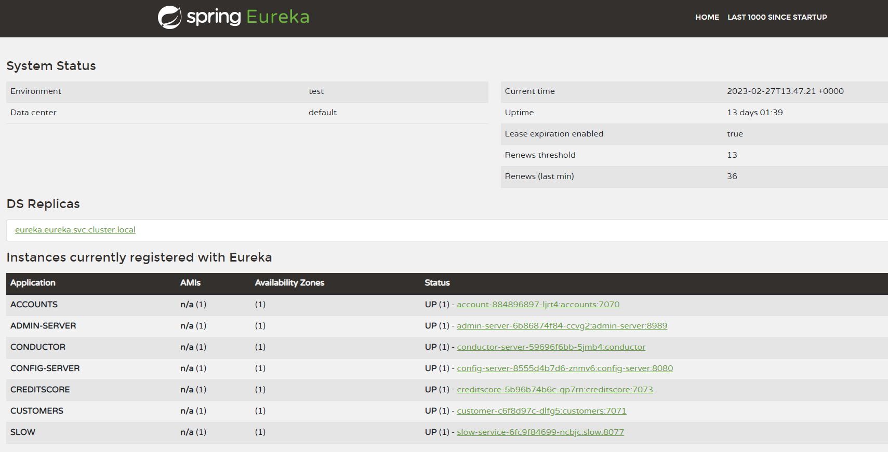
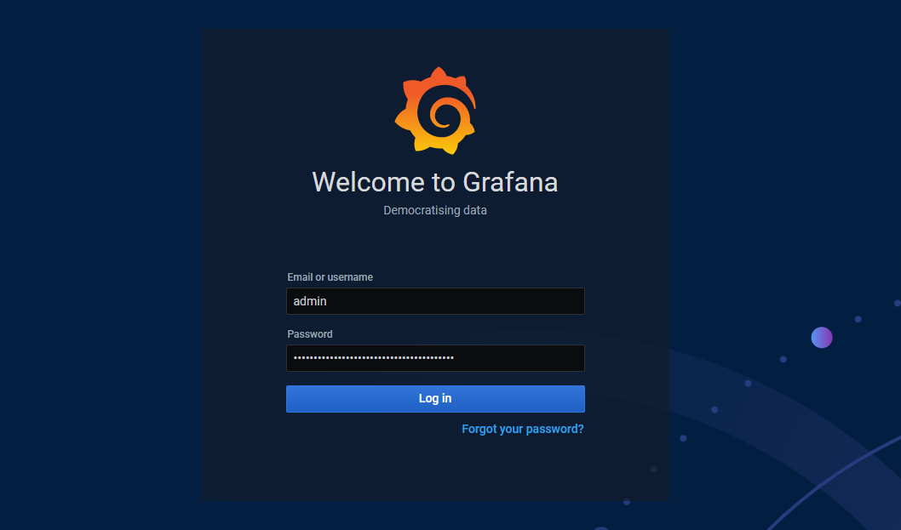
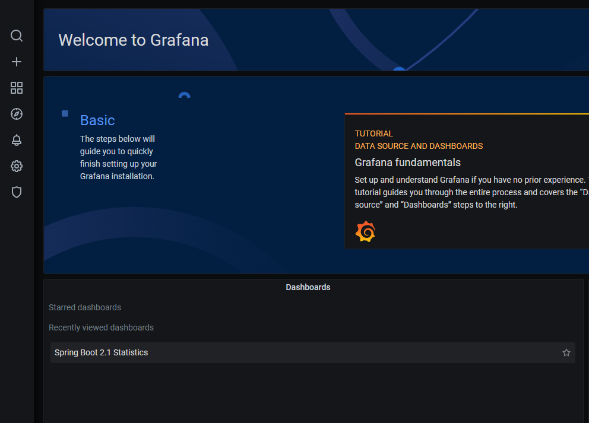
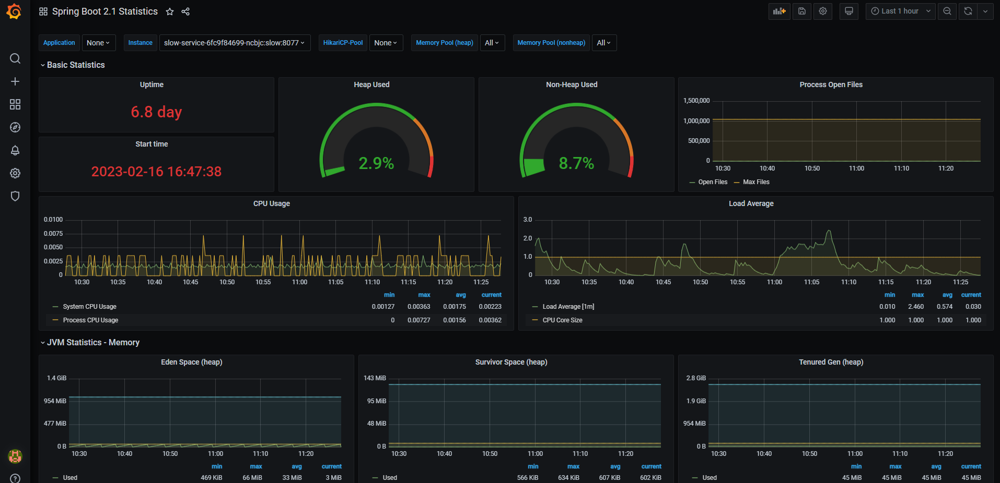
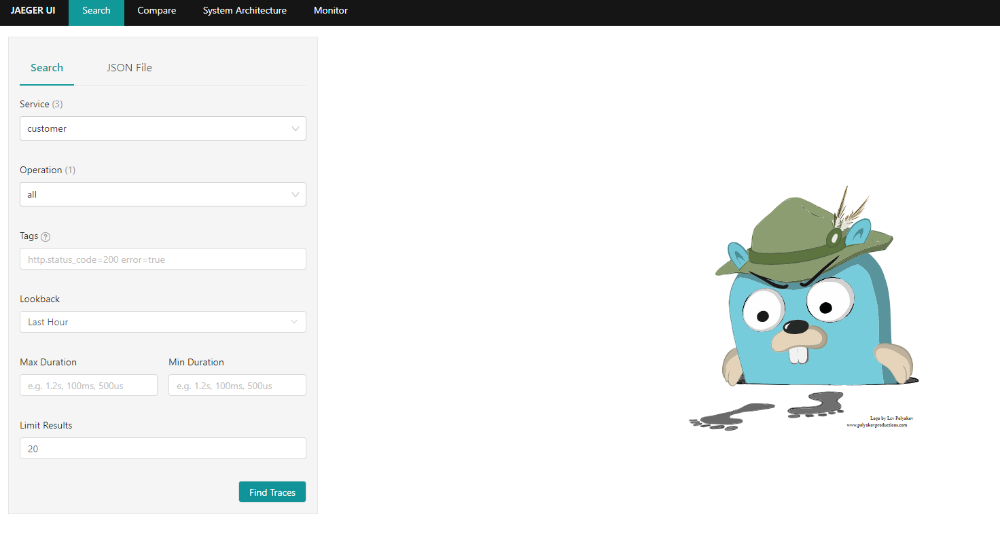

# Explore the Backend Platform

## Introduction

This lab walks you through various features of Oracle Backend for Spring Boot, including Parse Platform, and shows you how to use them.

Estimated Time: 20 minutes

### Objectives

In this lab, you will:
* Review the components of the Oracle Backend for Spring Boot
* Explore how microservice data is stored in the Oracle Autonomous Database
* Learn about the Spring Admin user interface
* Learn about Spring Eureka Service Registry
* Learn about APISIX API Gateway
* Learn about Spring Config Server
* Learn about the observability tools included in Oracle Backend for Spring Boot

### Prerequisites

This lab assumes you have:
* An Oracle Cloud account
* All previous labs successfully completed

## Task 1: Explore the Kuberenetes cluster 

Oracle Backend for Spring Boot includes a number of platform services which are deployed into the Oracle Container Engine for Kubernetes cluster.  You configured **kubectl** to access your cluster in an earlier lab.  In this task, you will explore the services deployed in the Kubernetes cluster.

1. Explore namespaces

   Kubernetes resources are grouped into namespaces.  To see a list of the namespaces in your cluster, use this command, your output will be slightly different: 

    ```
    $ <copy>kubectl get ns</copy>
    NAME                              STATUS   AGE
    admin-server                      Active   11d
    apisix                            Active   5d1h
    application                       Active   11d
    cert-manager                      Active   11d
    cloudbank                         Active   11d
    conductor-server                  Active   11d
    config-server                     Active   11d
    default                           Active   11d
    eureka                            Active   11d
    grafana                           Active   4d9h
    ingress-nginx                     Active   11d
    kafka                             Active   9d
    kube-node-lease                   Active   11d
    kube-public                       Active   11d
    kube-system                       Active   11d
    obaas-admin                       Active   11d
    observability                     Active   11d
    open-telemetry                    Active   11d
    oracle-database-operator-system   Active   11d
    otmm                              Active   9d
    prometheus                        Active   4d9h
    vault                             Active   5d3h
    ```

   Here is a summary of what is in each of these namespaces: 

   * `admin-server` contains Spring Admin which can be used to monitor and manage your services
   * `apisix` contains the APISIX API Gateway and Dashboard which can be used to expose services outside the cluster
   * `application` is a pre-created namespace with the Oracle Database wallet and secrets pre-configured to allow services deployed there to access the Oracle Autonomous Database instance
   * `cert-manager` contains Cert Manager which is used to manage X.509 certificates for services
   * `cloudbank` is the namespace where you deployed the CloudBank sample application
   * `conductor-server` contains Netflix Conductor OSS which can be used to manage workflows
   * `eureka` contains the Spring Eureka Service Registry which is used for service discovery
   * `grafana` contains Grafana which can be used to monitor and manage your environment
   * `ingress-nginx` contains the NGINX ingress controller which is used to manage external access to the cluster
   * `kafka` contains a three-node Kafka cluster that can be used by your applciation
   * `obaas-admin` contains the Oracle Backend for Spring Boot administration server that manages deployment of your services
   * `observability` contains Jaeger tracing which is used for viewing distributed traces
   * `open-telemetry` contains the Open Telemetry Collector which is used to collect distributed tracing information for your services
   * `oracle-database-operator-system` contains the Oracle Database Operator for Kubernetes which can be used to manage Oracle Databases in Kubernetes environements
   * `otmm` contains Oracle Transaction Manager for Microservices which is used to manage transactions acorss services
   * `prometheus` contains Prometheus which collects metrics about your services and makes the available to Grafana for alerting and dashboarding
   * `vault` contains HashiCorp Vault which can be used to store secret or sensitive infomration for services, like credentials for example

   Kubernetes namespaces contain other resources like pods, services, secrets and config maps.  You will explore some of these now. 

1. Explore pods 

   TODO

1. Explore services

   TODO

1. Explore secrets

   TDOO

1. Explore config maps

   TODO


   

## Task 2: Explore the Oracle Autonomous Database instance

xyz

1. Do something

   instuctions

   


## Task 3: Explore Spring Admin

xyz

1. Do something

   instuctions

    ```
    <copy>kubectl -n admin-server port-forward svc/admin-server 8989:8989</copy>
    ```

    Open a web browser to [http://localhost:8989](http://localhost:8989) to view the Spring Admin web user interface.

    Click on **TODO** to view the "wallboard" which shows all of the discovered services.  Spring Admin discovers services from the Spring Eureka Service Registry.

   

1. Do something

   instuctions

   

1. Do something

   instuctions

   


## Task 4: Explore Spring Eureka Service Registry

xyz

1. Start a port-forward tunnel to access the Eureka web user interface

   Start the tunnel using this command.  You can run this in the background if you prefer.

    ```
    $ <copy>kubectl -n eureka port-forward svc/eureka 8080:8761</copy>
    ```

   Open a web broswer to [http://localhost:8080](http://localhost:8080) to view the Eureka web user interface.  It will appear similar to the image below.

   TODO replace this image with one that shows all service deployed.

   

## Task 5: Explore APISIX API Gateway

xyz

1. Do something

   Start the tunnel using this command.  You can run this in the background if you prefer.

    ```
    $ <copy>kubectl n apisix port-forward svc/apisix-dashboard 8080:80</copy>
    ```

   Open a web broswer to [http://localhost:8080](http://localhost:8080) to view the APISIX Dashboard web user interface.  It will appear similar to the image below.
   
   instuctions

   


## Task 1: Explore Spring Config Server

xyz

1. Do something

   instuctions

   

## Task 1: Explore Prometheus and Grafana

xyz

1. Do something

    Get the password for the Grafana admin user using this command (your output will be different): 

    ```
    $ <copy>kubectl -n grafana get secret grafana -o jsonpath='{.data.admin-password}' | base64 -d</copy>
    fusHDM7xdwJXyUM2bLmydmN1V6b3IyPVRUxDtqu7
    ```

   Start the tunnel using this command.  You can run this in the background if you prefer.

    ```
    $ <copy>kubectl -n grafana port-forward svc/grafana 8080:80</copy>
    ```

   Open a web broswer to [http://localhost:8080](http://localhost:8080) to view the Grafana web user interface.  It will appear similar to the image below.  Log in with the username **admin** and the password you just got.

   

   In the lower left there is a list of pre-installed dashbaords, click on the link to open the **Spring Boot Dashboard**. 

   

   The Spring Boot Dashboard looks like the image below.  Use the **Instance** selctor at the top to choose which microservice you wish to view information for.

   

## Task 1: Explore Jaeger

xyz

1. Do something

   instuctions

   Start the tunnel using this command.  You can run this in the background if you prefer.

    ```
    $ <copy>kubectl -n observability port-forward svc/jaegertracing-query 16686:16686</copy>
    ```

   Open a web broswer to [http://localhost:16686](http://localhost:16686) to view the Jaeger web user interface.  It will appear similar to the image below. 

   

## Task 1: Explore XYZ 

xyz

1. Do something

   instuctions

   


## Learn More

*(optional - include links to docs, white papers, blogs, etc)*

* [URL text 1](http://docs.oracle.com)
* [URL text 2](http://docs.oracle.com)

## Acknowledgements
* **Author** - Mark Nelson, Developer Evangelist, Oracle Database
* **Contributors** - [](var:contributors)
* **Last Updated By/Date** - Mark Nelson, February 2023
