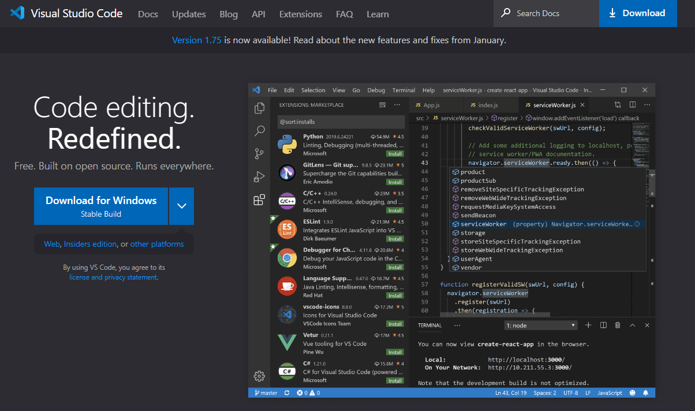
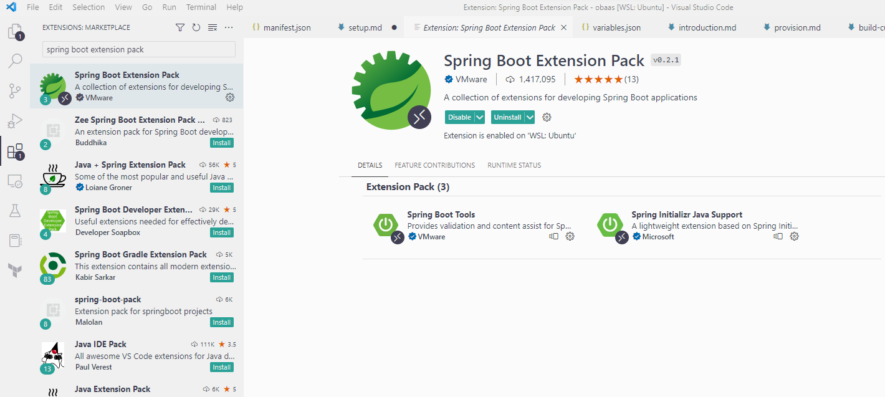

# Setup your Development Environment

## Introduction

This lab walks you through setting up your development environment to work with Oracle Backend for Spring Boot. 

Estimated Lab Time: 20 minutes

### Recommended Development Environment platforms and tools

The following platforms are recommended for a development environment:

- Windows 10 or 11, preferrably with Windows Subsystem for Linux 2
- macOS (11 or later recommended) on Intel or Apple silicon
- Linux, e.g., Oracle Linux, Ubuntu, etc.

The following tools are recommended for a development environment:

- Integrated Development Environment, e.g., Visual Studio Code
- Java Development Kit, e.g., Oracle, OpenJDK, or GraalVM 
- Maven or Gradle for build and testing automation

If you wish to test locally or offline, the following additional tools are recommended:

- A container platform, e.g., Rancher Desktop
- An Oracle Database (in a container)

### Objectives

In this lab, you will:
* Install the tools needed to develop and deploy applications using Oracle Backend for Spring Boot
* (Optional) Install the tools needed to develop mobile and/or web applications using Oracle Backend for Spring Boot (iuncluding Parse Platform)

### Prerequisites

This lab assumes you have:
* One of the recommended platforms, as listed above


## Task 1: Install the Integrated Development Environment

   Oracle recommends Visual Studio Code, which you can download [here](https://code.visualstudio.com/), and the following extensions to make it easier to write and build your code:

   - [Spring Boot Extension Pack](https://marketplace.visualstudio.com/items?itemName=pivotal.vscode-boot-dev-pack)
   - [Extension Pack for Java](https://marketplace.visualstudio.com/items?itemName=vscjava.vscode-java-pack)
   - [Oracle Developer Tools](https://marketplace.visualstudio.com/items?itemName=Oracle.oracledevtools)

   > **Note**: It is possible to use other Integrated Development Environments however all of the instructions in this Live Lab are written for and tested with Visual Studio Code, so we recommend that you use it for this Live Lab.

1. Download and install Visual Studio Code

   Download Visual Studio Code from [this web site](https://code.visualstudio.com/) and run the installer for your operating system to install it on your machine.

   

1. Install the recommended extensions
   
   Start Visual Studio Code, and then open the extensions tab (Ctrl-Shift-X or equivalent) and use the search bar at the top to find and install each of the extensions listed above.

   

## Task 2: Install a Java Development Kit

   Oracle recommends the [Java SE Development Kit](https://www.oracle.com/java/technologies/downloads/#java17).
   If you are using Spring Boot version 2.x, then Java 11 is recommended.
   If you are using Spting Boot version 3.x, then Java 17 is recommended, note that Spring Boot 3.0 requires at least Java 17.

   Even if you are using Spring Boot 2.x, Oracle encourages you to use at least Java 17, unless you have a specific reason to stay on Java 11. 

1. Download and install the Java Development Kit 

   Download the latest x64 Java 17 Development Kit from [this permalink](https://download.oracle.com/java/17/latest/jdk-17_linux-x64_bin.tar.gz).

   Decompress the archive in your chosen location, e.g., your home directory and then add it to your path:

   ```
   <copy>
   export JAVA_HOME=$HOME/jdk-17.0.3
   export PATH=$JAVA_HOME/bin:$PATH
   </copy>
   ```
1. Verify the installation

   Verify the Java Development Kit is installed with this command:

   ```
   $ <copy>java -version</copy>
   java version "17.0.3" 2022-04-19 LTS
   Java(TM) SE Runtime Environment (build 17.0.3+8-LTS-111)
   Java HotSpot(TM) 64-Bit Server VM (build 17.0.3+8-LTS-111, mixed mode, sharing)
   ```

   > **Note: Native Images:** If you want to compile your Spring Boot microservices into native images, you must use GraalVM, which can be downloaded [from here](https://www.graalvm.org/downloads/).

## Task 3: Install Maven

You can use either Maven or Gradle to build your Spring Boot applications.  If you prefer Maven, follow the steps in this task.  If you prefer Gradle, skip to the next task instead. 

1. Download Maven

   Download Maven from the [Apache Maven website](https://maven.apache.org/download.cgi).  

1. Install Maven

   Decompress the archive in your chosen location, e.g., your home directory and then add it to your path:

   ```
   <copy>export PATH=$HOME/apache-maven-3.8.6/bin:$PATH</copy>
   ```

1. Verify installation

   You can verify it is installed with this command (note that your version may give slightly different output):

   ```
   $ <copy>mvn -v</copy>
   Apache Maven 3.8.6 (84538c9988a25aec085021c365c560670ad80f63)
   Maven home: /home/mark/apache-maven-3.8.6
   Java version: 17.0.3, vendor: Oracle Corporation, runtime: /home/mark/jdk-17.0.3
   Default locale: en, platform encoding: UTF-8
   OS name: "linux", version: "5.10.102.1-microsoft-standard-wsl2", arch: "amd64", family: "unix"
   ```

## Task 4: Install Gradle (Optional)

If you prefer Gradle, follow the steps in this task.  

> **Note**:  All of the examples in this Live Lab use Maven.  We strongly recommend that you use Maven for this Live Lab.  

1. Download and install Gradle

   Download Gradle using [the instructions on the Gradle website](https://gradle.org/install/).  Spring Boot is compatible with Gradle version 7.5 or later.

1. Verify the installation

   Run the command below to verify Gradle was installed correctly:

   ```
   $ <copy>gradle -v</copy>

   ------------------------------------------------------------
   Gradle 7.6
   ------------------------------------------------------------

   Build time:   2022-11-25 13:35:10 UTC
   Revision:     daece9dbc5b79370cc8e4fd6fe4b2cd400e150a8

   Kotlin:       1.7.10
   Groovy:       3.0.13
   Ant:          Apache Ant(TM) version 1.10.11 compiled on July 10 2021
   JVM:          17.0.3 (Oracle Corporation 17.0.3+8-LTS-111)
   OS:           Linux 5.10.102.1-microsoft-standard-WSL2 amd64
   ```

## Task 5: Install the Oracle Backend for Spring Boot CLI 

The Oracle Backend for Spring Boot CLI is used to configure your backend and to deploy your Spring Boot applications to the backend. 

1. Download the CLI

   Download the CLI from [here](#)

1. Install the CLI

   To install the CLI, you just need to make sure it is executable and add it to your PATH enviironment variable.

   ```
   <copy>
   chmod +x oractl
   export PATH=/path/to/oractl:$PATH
   </copy>
   ```

1. Verify the installation

  Verify the CLI is installed using this command: 

  ```text
  $ ~/ebaas/oractl version
     _   _           __    _    ___
    / \ |_)  _.  _. (_    /  |   |
    \_/ |_) (_| (_| __)   \_ |_ _|_

   2023-02-22T15:05:40.835-05:00  INFO 29309 --- [           main] o.s.s.cli.OracleSpringCLIApplication     : Starting AOT-processed OracleSpringCLIApplication using Java 17.0.5 with PID 29309 (/home/mark/ebaas/oractl started by mark in /home/mark/ebaas/SECOND-COPY/microservices-datadriven)
   2023-02-22T15:05:40.835-05:00  INFO 29309 --- [           main] o.s.s.cli.OracleSpringCLIApplication     : No active profile set, falling back to 1 default profile: "default"
   2023-02-22T15:05:40.873-05:00  INFO 29309 --- [           main] o.s.s.cli.OracleSpringCLIApplication     : Started OracleSpringCLIApplication in 0.047 seconds (process running for 0.049)
   Build Version: 011223
   ```


## Task N: Install XYZ


## (Optional) Task X: Install Flutter

If you plan to complete the Mobile App Development lab, you will need to install Flutter.  This is not required if you are only going to complete the Spring Boot labs.


## Learn More

*(optional - include links to docs, white papers, blogs, etc)*

* [URL text 1](http://docs.oracle.com)
* [URL text 2](http://docs.oracle.com)

## Acknowledgements
* **Author** - Mark Nelson, Developer Evangelist, Oracle Database
* **Contributors** - [](var:contributors)
* **Last Updated By/Date** - Mark Nelson, February 2023

